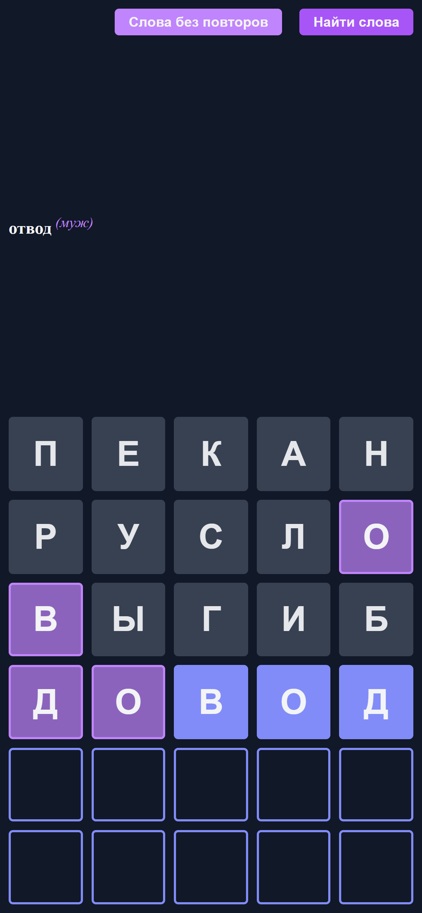

# Помощник для игры в 5‑буквенные слова

Лёгкое веб‑приложение, которое помогает отгадывать пять‑буквенные слова (похоже на Wordle) на русском языке. Фильтрует существительные по подсказкам: буквы **отсутствуют**, **есть (но не на этой позиции)** или **угаданы**.

---

## Функции

- 📜 Список всех пяти‑буквенных русских существительных  
- 🚫 Фильтр “без повторов” (только уникальные буквы)  
- 🎯 Интерактивная клавиатура: тап по букве → отметить как **absent**, **present** или **correct**  
- ⚡️ Быстрый бэкенд на Node.js + Hono + MariaDB  
- 🐳 Готовый к запуску в Docker Compose

---

## Screenshots
<p align="center">
  
</p>

---


## Технологии

- **Frontend**: HTML / CSS / Vanilla JS  
- **Backend**: [Hono](https://github.com/honojs/hono) на Node.js  
- **БД**: MariaDB  
- **Сборка**: esbuild
- **Контейнеризация**: Docker + Docker Compose  

---

## Установка и запуск локально

1. Клонировать репозиторий  
   ```bash
   git clone [https://github.com/ваш‑пользователь/5‑letter-helper.git](https://github.com/nazarukroman/letters.git)
   cd letters
   ```
2. Установить зависимости  
   ```bash
   pnpm install
   ```
3. Создать файл `.env` в корне:
   ```dotenv
   CLIENT_PORT=4005
   DB_HOST=localhost // для работы в докере - mariadb
   DB_PORT=3306
   MYSQL_DATABASE=letters_db
   MYSQL_USER=<ваш_юзер>
   MYSQL_PASSWORD=<ваш_пароль>
   ```
4. Собрать и запустить
   dev mode:
   ```bash
   pnpm run dev
   ```
   prod mode:
   ```bash
   pnpm run build
   node dist/index.js
   ```
6. Открыть в браузере: http://localhost:3000

---

## Запуск через Docker Compose

```bash
docker build -t letters:latest .
docker-compose up --build
```

Приложение будет доступно на порту, заданном в `PORT`, а БД автоматически инициализируется скриптом из `db/`.

---

## Конфигурация (`.env`)

| Переменная       | Описание                                 | По умолчанию   |
|------------------|------------------------------------------|----------------|
| `CLIENT_PORT`    | Порт HTTP‑сервера                        | `3000`         |
| `DB_HOST`        | Адрес MariaDB (имя сервиса в Docker)     | `mariadb` или `localhost` |
| `DB_PORT`        | Порт MariaDB                             | `3306`         |
| `MYSQL_DATABASE` | Имя базы данных                          | `letters_db`   |
| `MYSQL_USER`     | Пользователь БД                          | `<ваш_юзер>`   |
| `MYSQL_PASSWORD` | Пароль БД                                | `<ваш_пароль>` |

---

## API

### GET /api/words/random?count=30

- Возвращает 30 рандомных слов.  

### POST /api/words/pattern

- Тело (`application/json`):
  ```json
  {
    "pattern": [
      { "letter": "п", "state": "absent",  "position": 0 },
      { "letter": "и", "state": "absent",  "position": 1 },
      { "letter": "р", "state": "absent",  "position": 2 },
      { "letter": "а", "state": "absent",  "position": 3 },
      { "letter": "т", "state": "absent",  "position": 4 }
    ]
  }
  ```
- Возвращает отфильтрованный список `{ word, gender }`.

### POST /api/words/pattern-without-repetitions

- Тело (`application/json`):
  ```json
  {
    "pattern": [
      { "letter": "п", "state": "absent",  "position": 0 },
      { "letter": "и", "state": "absent",  "position": 1 },
      { "letter": "р", "state": "absent",  "position": 2 },
      { "letter": "а", "state": "absent",  "position": 3 },
      { "letter": "т", "state": "absent",  "position": 4 }
    ]
  }
  ```
- Возвращает отфильтрованный список без повторяющихся букв внутри слова `{ word, gender }`.
